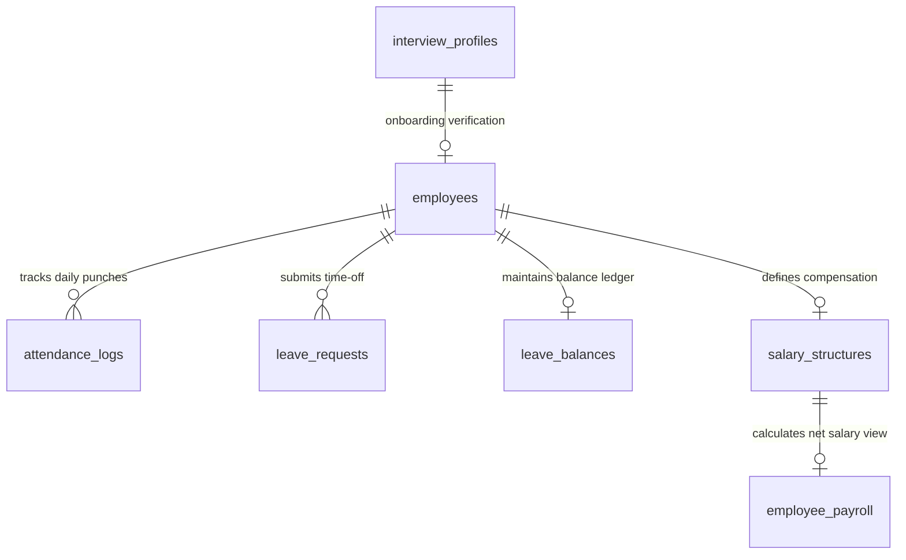

<div align="center">


### **EVERY WORKDAY, PERFECTLY ALIGNED.**

An enterprise-grade, high-performance Human Resource Management System (HRMS) built for modern organizations. Reconciles daily attendance geofencing, emergency leave workflows, recruitment onboarding verification, RBAC permissions, and automated payroll calculation into one seamless 3-column system-of-record.

---

[](https://reactjs.org/)
[](https://www.typescriptlang.org/)
[](https://vitejs.dev/)
[](https://tailwindcss.com/)
[](https://supabase.com/)

</div>

---

## 🌟 Executive Overview

**NexaWork** (DayFlow) solves critical human resource operational overhead by unifying workforce management into a single real-time platform. From candidate recruitment approval gates to instant automated payroll reconciliation, NexaWork ensures complete operational alignment for administrators, HR managers, and employees.

### ✨ Key Design Pillars
- **Align Green (`#1F6D4D`) & Fresh Mint (`#7EC9A0`) Design System**: Built with modern typography, glassmorphism cards, interactive micro-animations, and high-contrast accessibility.
- **Role-Based Access Control (RBAC)**: Strict segregation between Admin Control Tower and Employee Self-Service Workspace.
- **Geofenced Attendance & Proxy Detection**: Real-time location tracking with anomaly detection flags for out-of-bounds check-ins.
- **Emergency Leave Fast-Track**: Pinned emergency leave requests in Amber (`#F2994A`) for immediate 1-click HR resolution.
- **Automated Payroll Engine**: Live percentage-based allowances & deductions math with PDF payslip generation and automated welcome email credentials.

---

## 🚀 Complete Feature Matrix

### 👑 Admin Control Tower (7 Comprehensive Modules)

1. **Admin Dashboard (`/admin/dashboard`)**:
   - **Row 1 — Live Stat Cards**: `Total Employees`, `Present Today`, `Absent Today`, and `On Half-Day/Emergency Leave Today` (pinned in Amber `#F2994A`) with live deep-linking.
   - **Row 2 — Month-to-Date Requests Strip**: Live counters for Total, Approved, Rejected, and Pending leave requests.
   - **Row 3 — Analytics & Queue**: Mon–Sun Attendance Bar Chart, Compliance & Probation alerts, and real-time Leave Requests Queue with inline 1-click Approve/Reject actions. Emergency requests are pinned to the top.
   - **Row 4 — Feed & Meters**: Recent Employee Activity feed, Live Attendance Speedometer (% present), and HR Overhead Reduction Meter (hours saved card).

2. **Employee Directory (`/admin/directory`)**:
   - Master searchable grid/table with live presence status dots (Present, Absent, On Leave).
   - Department, Role, and Status filter dropdowns.
   - **+ Add Employee Modal**: Automated initial password generation, welcome email credentials dispatch, and salary structure initialization.

3. **Employee Profile Manager (`/admin/employee/:id`)**:
   - **3-Tab Layout**: Personal Details, Job Details, and Salary Info (Admin-Only).
   - **Live Salary Calculator**: Instant recalculation of HRA, DA, PF, Professional Tax, and Net Take-Home Pay upon Basic Salary edits before saving.
   - Offboarding deactivation workflow with audit logging.

4. **Attendance Records (`/admin/attendance`)**:
   - Full-width master log with Daily/Weekly views, date range picker, and department filtering.
   - Anomaly warning flags (Proxy Attendance Detector), expandable geofence location data, and 1-click CSV data export.

5. **Leave Requests & Approvals Queue (`/admin/leaves`)**:
   - Resolution Queue with Emergency requests sorted to the top in Amber (`#F2994A`).
   - Standard requests resolution with optional HR comments support and automatic balance deduction.

6. **Payroll Overview Engine (`/admin/payroll`)**:
   - Summary cards (Total Payroll Cost, Next Dispatched Date, Pending Setup count).
   - **Run Payroll Modal**: Anomaly review checks flagging missing punches and salary jumps before final calculation.
   - Itemized payslip generation & publication for employee access.

7. **Admin Settings (`/admin/settings`)**:
   - Company branding profile, shift timing rules, leave policy rules, notification preferences, and RBAC role permissions.

---

### 👤 Employee Self-Service Workspace (6 Comprehensive Modules)

1. **Employee Workspace (`/employee/dashboard`)**:
   - **Row 1 — Today's Overview**: Today's Status badge, Days Present This Month, Pending Approvals, Total Balance remaining.
   - **Row 2 — Leave Balance Strip**: Visual balance cards for Paid (14/18), Sick (8/10), and Unpaid (12 days).
   - **Row 3 — Personal Analytics**: Worked-Hours Bar Chart, Organization Announcements, and Personal Leave Requests list.
   - **Row 4 — Check-In Card & Live Timer**: Live worked-hours timer card, Check-In/Check-Out action, and 1-click "Leave Early / Emergency" trigger.

2. **My Profile (`/employee/profile`)**:
   - Self-service editing for contact number, address, and profile picture avatar (Job role & salary tier protected as read-only).

3. **Personal Attendance (`/employee/attendance`)**:
   - Personal attendance history log with status badges, check-in/out times, and geofence locations. Read-only system-of-record.

4. **Leave & Time-Off Center (`/employee/leaves`)**:
   - 4 Leave Balance cards featuring Align Green completion rings.
   - Standard Leave Request Form modal and instant 1-click Emergency Leave action.
   - Personal Leave History Table with HR approval comments.

5. **My Payslips (`/employee/payslips`)**:
   - Issued monthly payslips list displaying Pay Period, Dispatched Date, Gross Earnings, Total Deductions, and Net Take-Home Pay.
   - Detailed itemized view modal and PDF statement download.

6. **Employee Settings (`/employee/settings`)**:
   - Notification preferences toggle, security password change, and theme preferences.

---

## 🛠️ Technology Stack

| Layer | Technologies Used |
| :--- | :--- |
| **Frontend Framework** | React 18, TypeScript, Vite 6 |
| **Styling & UI** | Vanilla CSS Tokens, TailwindCSS 3.4, Lucide Icons, Glassmorphism Cards |
| **State Management** | React Context API (`AppContext`), LocalStorage Fallback Store |
| **Backend & Email Server**| Express.js, Node.js, Nodemailer (Ethereal Auto-Preview / Real Gmail SMTP) |
| **Database & Security** | Supabase PostgreSQL 15, Supabase Auth (`auth.users`), Row-Level Security (RLS) |
| **Database Logic** | PL/pgSQL Triggers, Automated Views (`employee_payroll`), Custom ENUM Types |

---

## 📁 Repository File Structure

```
NexaWork-website/
├── public/
│   └── assets/
│       ├── nexawork-logo.png             # Official NexaWork high-res logo
│       ├── nexawork-logo-transparent.png # Transparent background logo
│       └── nexawork-logo-white.png       # White typography logo for dark footers
├── src/
│   ├── assets/                          # Static assets
│   ├── components/
│   │   ├── attendance/                  # Attendance tables & modals
│   │   ├── employees/                   # Directory grids & tab forms
│   │   ├── layout/                      # Topbar, Sidebar, Official NexaWorkLogo
│   │   ├── leave/                       # Leave modals & approval tables
│   │   └── payroll/                     # Payslip viewer & payroll wizard
│   ├── lib/
│   │   ├── context/                     # AppContext global state manager
│   │   ├── data/                        # Mock data & sample initializers
│   │   └── supabaseClient.ts            # Supabase JS SDK client instance
│   ├── pages/
│   │   ├── admin/                       # 7 Admin Portal Pages
│   │   ├── auth/                        # Login & Registration Page
│   │   ├── employee/                    # 6 Employee Portal Pages
│   │   └── landing/                     # Landing Page (Default View)
│   ├── types/                           # TypeScript interfaces
│   ├── App.tsx                          # Core Application Routing
│   └── main.tsx                         # Entry point
├── supabase/
│   └── migrations/
│       ├── production_schema.sql        # Supabase PostgreSQL production migration
│       └── seed_data.sql                # Initial test dataset
├── server.js                            # Express backend server (Email notifications)
├── package.json
├── vite.config.ts
└── README.md
```

---

## ⚡ Quick Start & Local Setup

### 1. Clone the Repository
```bash
git clone https://github.com/Patelved2307/DayFlow-odoo-2026.git
cd DayFlow-odoo-2026
```

### 2. Install Dependencies
```bash
npm install
```

### 3. Environment Configuration
Create a `.env` file in the project root (or copy `.env.example`):
```env
# Supabase Configuration
VITE_SUPABASE_URL="https://your-project-id.supabase.co"
VITE_SUPABASE_ANON_KEY="your-anon-public-key"

# Backend Express Server
PORT=3001

# SMTP Email Configuration (Optional - Defaults to Ethereal Auto-Preview)
SMTP_HOST="smtp.gmail.com"
SMTP_PORT=587
SMTP_USER="your-email@gmail.com"
SMTP_PASS="your-app-password"

APP_URL="http://localhost:3000"
```

### 4. Run Database Migration on Supabase
1. Open your [Supabase Dashboard](https://supabase.com/dashboard).
2. Go to **SQL Editor** (`>_` icon on left menu) -> **New Query**.
3. Copy and paste the contents of [`supabase/migrations/production_schema.sql`](./supabase/migrations/production_schema.sql) and click **Run**.

### 5. Launch Development Servers
Run the frontend web application:
```bash
npm run dev
```
*(Runs on `http://localhost:3000`)*

Run the backend email server (in a second terminal):
```bash
node server.js
```
*(Runs on `http://localhost:3001`)*

---

## 🗄️ Database Architecture & RLS Security

The database runs on **Supabase PostgreSQL** with automated security triggers and Row-Level Security (RLS):



- **`handle_supabase_new_user()` Trigger**: Intercepts user registrations, verifies candidate approval status in `interview_profiles`, and auto-populates `employees`.
- **`handle_new_employee_init()` Trigger**: Automatically seeds 15 Paid, 10 Sick, and 5 Unpaid leave balances and salary structures upon employee creation.
- **`employee_payroll` View**: Performs live automated calculation of HRA, DA, PF, Professional Tax, and Net Take-Home Pay.

---

